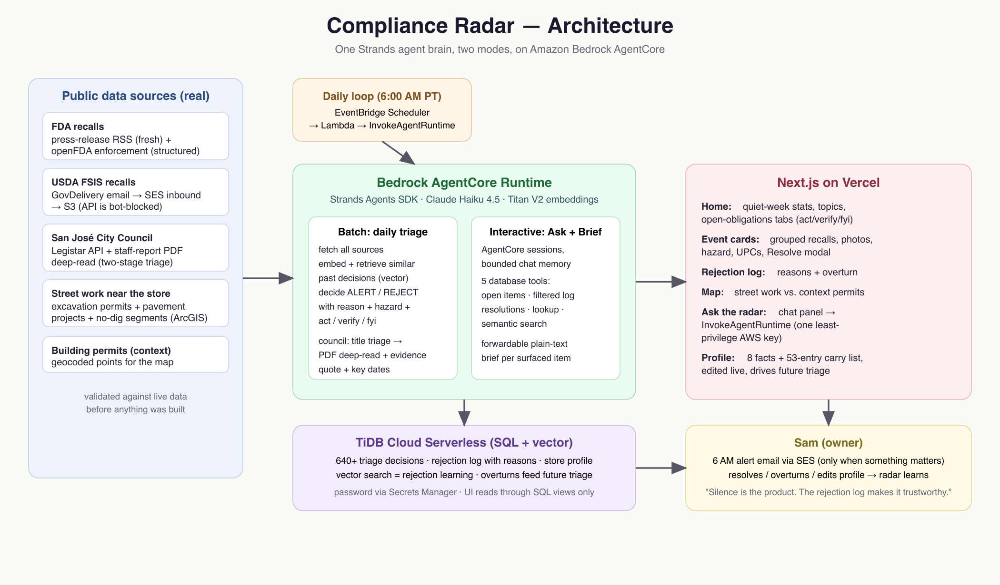

# Compliance Radar

A background compliance monitoring agent for main street businesses, built
first for the hardest case: a small independent grocery store. It reads food
recall feeds, city council agendas, and street-work permits every day,
reasons about them against a deep profile of one specific store, and stays
silent unless something genuinely affects that store.

**Silence is the product.** The signature feature is the rejection log: every
item the radar chose NOT to interrupt the owner about, each with a one-line
reason. The owner can overturn any rejection, and that correction feeds
future triage. Built for the AWS "Agents for Humans" hackathon
(Professional Agents track).

**Live:** https://shopbell.minjeaseo.com (the product is branded Shopbell in
the UI; this repository keeps its original Compliance Radar name).



## What it watches (all real, live sources)

| Source | Channel | Notes |
|---|---|---|
| FDA food recalls | press-release RSS + openFDA enforcement API | RSS is day-fresh; openFDA supplies structure (class, distribution, event grouping) |
| USDA FSIS recalls | official GovDelivery email → SES inbound → S3 | the FSIS API is bot-blocked at the network edge; the email channel is FSIS's own alert path |
| San José City Council | Legistar API + staff-report PDF deep-reads | two-stage triage catches what consent-calendar titles hide |
| Street work near the store | ArcGIS: excavation permits, pavement projects, no-dig segments | answers "is anything about to block my sidewalk, street, or parking?" |
| Building permits | ArcGIS geocoded points | map context only |

## How it works

One Strands agent brain, two modes, on one Amazon Bedrock AgentCore Runtime:

- **Batch (daily 6 AM):** EventBridge Scheduler → Lambda → InvokeAgentRuntime.
  The agent fetches all sources, embeds each new item (Titan V2), retrieves
  similar past decisions from TiDB vector search (this is how overturns
  teach it), and decides ALERT / REJECT / OPPORTUNITY with a recorded reason,
  hazard, and an act/verify/fyi action type. Council items that survive
  title triage get their staff-report PDF read, with key dates and an
  evidence quote (page number included) extracted for the UI.
- **Interactive:** the web app invokes the same runtime with AgentCore
  session ids. "Ask the radar" is a Strands agent with five database tools
  (open items, filtered log, resolution history, decision lookup, semantic
  search) and bounded per-session memory; it also generates forwardable
  plain-text briefs.

State lives in **TiDB Cloud Serverless** (SQL + vector): documents, every
decision with its reason and embedding, resolutions, overturns, and the
store profile the UI edits live. We deliberately did not use AgentCore
Memory for domain state: the rejection log is auditable product data that
the UI queries in SQL and the owner overturns row by row; conversational
context is session-scoped agent state.

The frontend is Next.js on Vercel, reading TiDB through SQL views with the
serverless HTTP driver, holding exactly one least-privilege AWS key
(InvokeAgentRuntime only). The TiDB password lives in AWS Secrets Manager.

## The store (persona is configuration, not code)

"Willow Glen Family Market": a fictional 18-employee grocery with a deli
counter, on the real Lincoln Avenue commercial strip in San José. The
reasoning engine knows nothing about groceries; everything store-specific
lives in an editable profile: 8 facts (deli, beer & wine but no spirits, no
tobacco, SNAP/EBT, headcount, parking, single location, a planned sidewalk
display) and a 53-entry carry list at category + brand level. Swap the
profile and the same radar watches a salon or a taqueria.

## Repository layout

```
complianceradar/app/complianceradar/   AgentCore runtime (Strands agent, sources, triage)
  radar/pipeline.py                    daily triage loop + prompts
  radar/council_triage.py              two-stage council triage with PDF deep-read
  radar/ask.py                         tool-using chat agent
  radar/street_work.py, permits.py, fda_recalls.py, fsis_email.py, legistar.py
complianceradar/agentcore/             CDK deploy project (agentcore CLI)
web/                                   Next.js app (Vercel)
db/                                    schema + migrations + local access layer
docs/ui-data-contract.md               the FE/BE data contract (single source of truth)
docs/demo-script.md                    demo click-through script
analysis/                              validation and data-mining reports
trigger/daily_trigger.py               EventBridge-invoked Lambda
scripts/                               one-time backfills (all documented) +
                                       demo_numbers.py (prints every figure
                                       the demo script quotes, from TiDB)
```

## Honest-data rules we built under

Real data everywhere; the only simulation allowed is replaying backfilled
real data. Historical triage decisions are never rewritten after prompt
changes (our best demo moment is a genuine miss the owner overturns).
Display fields (short reasons, hazards, product structure) are extracted
from source text, never invented, with UPCs regex-validated before storage.
The carry list was frozen in git history before demo items were selected.

## Running it

Backend requires AWS credentials (us-west-2), a TiDB Cloud Serverless
cluster, and `.env.local` at the repo root (see `db/client.py` for keys);
deploy the runtime with `agentcore deploy` from `complianceradar/`. The web
app needs `web/.env.local` (TiDB serverless driver URL + the invoke-only
AWS key). Secrets are never committed.

## License

MIT — see [LICENSE](LICENSE).
